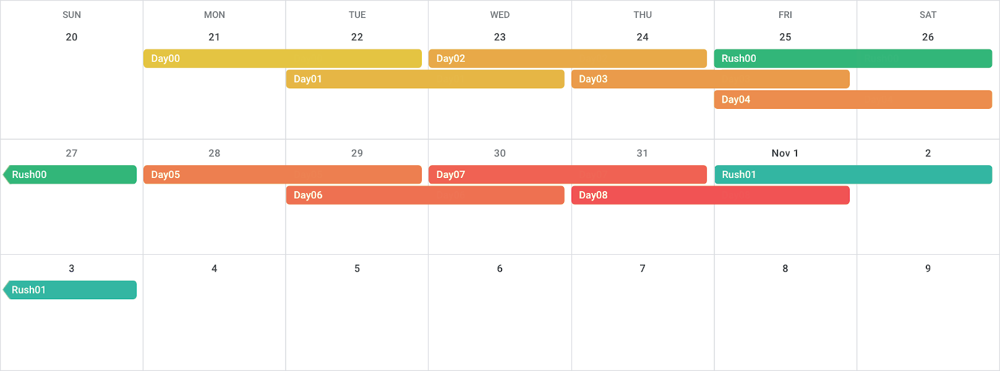

## First week

| Day00 | Day01 | Day02 | Day03 | Day04 |
|-------|-------|-------|------ | ----- |
| <ul><li>-[x] `ex00`</li><li>-[x] `ex01`</li><li>-[x] `ex02`</li></ul> | <ul><li>-[x] `ex00` heap and stack</li><li>-[x] `ex01` heap and stack</li><li>-[x] `ex02`</li><li>-[x] `ex03`</li><li>-[x] `ex04`</li><li>-[x] `ex05`</li><li>-[ ] `ex06`</li><li>-[ ] `ex07`</li><li>-[ ] `ex08`</li><li>-[ ] `ex09`</li><li>-[ ] `ex10`</li></ul> | <ul><li>-[x] `ex00`</li><li>-[x] `ex01`</li><li>-[x] `ex02` inheritance</li><li>-[x] `ex03` inheritance</li><li>-[ ] `ex04` the diamond problem</li></ul> | <ul><li>-[ ] `ex00`</li><li>-[ ] `ex01`</li><li>-[ ] `ex02`</li><li>-[ ] `ex03`</li><li>-[ ] `ex04`</li></ul> | <ul><li>-[ ] `ex00`</li><li>-[ ] `ex01`</li><li>-[ ] `ex02`</li><li>-[ ] `ex03`</li><li>-[ ] `ex04`</li></ul>
| **Day05** | **Day06** | **Day07** | **Day08** |
| <ul><li>-[ ] `ex00`</li><li>-[ ] `ex01`</li><li>-[ ] `ex02`</li><li>-[ ] `ex03`</li><li>-[ ] `ex04`</li><li>-[ ] `ex05`</li></ul> | <ul><li>-[ ] `ex00`</li><li>-[ ] `ex01`</li><li>-[ ] `ex02`</li></ul> | <ul><li>-[x] `ex00` Use function template</li><li>-[x] `ex01` Write function template</li><li>-[x] `ex02`</li></ul> | <ul><li>-[x] `ex00`</li><li>-[x] `ex01`</li><li>-[x] `ex02`</li><li>-[ ] `ex03`</li><li>-[ ] `ex04`</li></ul>
